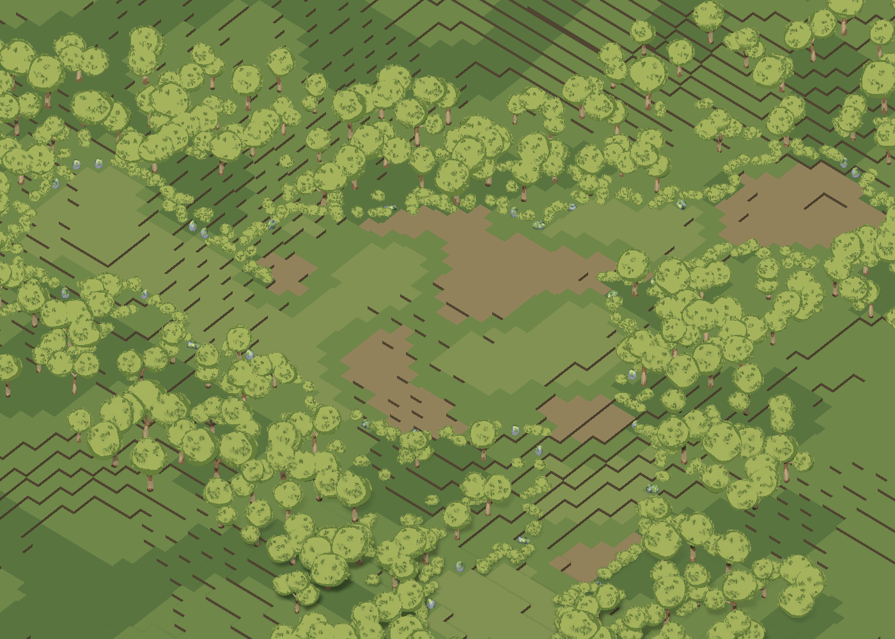
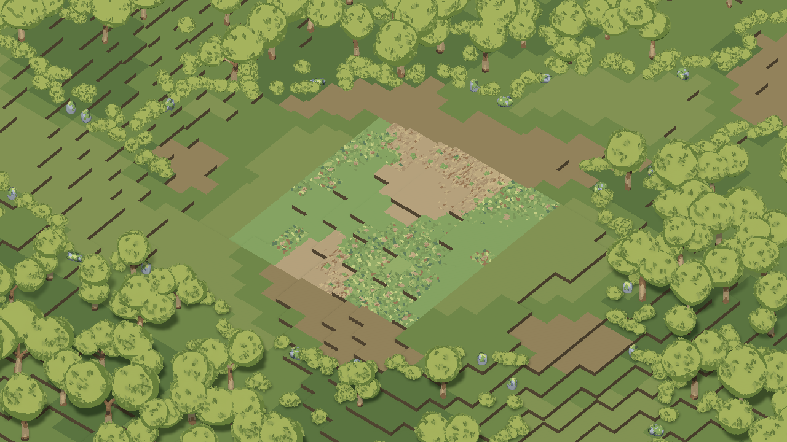

# Tiles Voxel Studio
### Unity에서 만드는 복셀 환경과 절차적 타일 제작 도구

레퍼런스를 바탕으로 환경 오브젝트를 제작하고, 같은 스타일의 타일과 지형으로 확장하는 개발 중인 Unity 도구입니다.
AI와 사용자가 같은 편집 코어를 사용하며, 제작 원본과 게임용 출력물을 분리해 보존합니다.

**소스는 비공개입니다. 이 저장소에는 소개와 실제 Unity 시험 화면만 공개합니다.**

## 제작 흐름
레퍼런스 해석 → 부품과 형태 제작 → 팔레트와 표면 조정 → 게임 시점 검토 → 원본·메시·프리팹 저장.
이미지 해석은 연결된 외부 AI가 담당합니다. Unity 도구 자체에 독립적인 이미지 이해 모델이 내장되어 있지는 않습니다.

## 주요 기능
| 분야 | 구현 내용 |
|---|---|
| 복셀 편집 | 좌표 기반 도형·선택·색칠·변환, 부품 관리, 보호 영역, 작업 이력 |
| 타일 표면 | 풀·흙의 도트 표현, 같은 높이의 경계 침범, 구역별 디테일 분포 |
| 환경 제작 | 나무·관목과 숲 소품 제작 실험, 식생 반응, 스타일 재질 |
| 물 표현 | 잔물결·경계 반응·폭포 표현 실험. 완전한 유체 시뮬레이션은 아님 |
| 절차적 지형 | 독립된 높이/통행 마스크, 전장 후보, 탐색 분기, 주변 식생 배치 |
| 결과 재사용 | 조건이 같은 표면 청크의 메시·텍스처·재질을 저장 후 재사용 |

## 구역별 타일 표현
깨끗한 색면과 복잡한 도트 군집을 구역별로 묶되, 각 타일에는 예외와 변주를 남깁니다.
아래 화면의 중앙 12×12칸은 표준 표현을 적용한 비교 구역이며, 주변 지면은 구조 확인용 단색 표현입니다.

## 실제 측정 사례
2026-09-22 Unity 에디터에서 144칸·55청크를 대상으로 측정했습니다. 새 출력 폴더에 처음 생성하는 경우와 저장된 결과를 재사용하는 경우를 구분합니다.

| 작업 | 측정값 — 3회 중앙값 (범위) |
|---|---:|
| 첫 생성·저장·에디터 등록·배치 | 3.841초 (3.715~4.002초) |
| 같은 결과 재사용 배치 | 0.291초 (0.284~0.308초) |
| 재사용 시 새로 생성한 청크 | 0 / 55 |

복셀 해상도를 낮추지 않고 중복 계산과 에셋 등록 비용을 줄였습니다. 마지막 비교 실행에서 기존 결과와 개선 후 결과의 메시·텍스처·재질 속성이 같음을 확인했고, 편집·보호·복원·저장·분포 관련 검증 50개를 통과했습니다.
최초 생성은 출력 캐시가 없는 상태를 뜻하며 Unity·OS 캐시까지 초기화한 측정은 아닙니다. 씬 파일 저장과 전체 식생 생성은 제외했습니다. 이 수치는 해당 시험 환경의 에디터 작업 시간으로, 게임 로딩 시간이나 GPU 프레임 성능을 의미하지 않습니다.

## 개발 상태
현재는 제작 도구와 개별 생성 흐름을 검증하는 단계입니다.
전체 맵의 고밀도 표면 적용, 식생 LOD, 거리별 로딩, SRPG 캐릭터 이동과 전투 통합은 진행 과제입니다.
일부 데모는 별도 게임 프로젝트의 제작 에셋에 의존합니다.

**기술 환경:** C# · Unity 6 · URP · HLSL · JSON 기반 제작 데이터

## 공개 범위
이 페이지는 프로젝트 소개용입니다. 구현 소스·설정 원본·개인 작업 자료는 포함하지 않습니다.
별도의 오픈소스 라이선스를 부여하지 않습니다. 외부 기술과 라이브러리의 권리는 각 권리자에게 있습니다.
